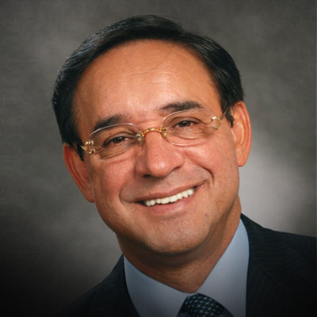
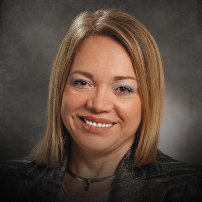

«Видеть каждого человека живущим той жизнью, которую Бог для него предназначил, познать Христа и сделать Его известным повсюду».  
**Евангелизм (завоёвывать души):** «Идите по всему миру и проповедуйте Евангелие всей твари» (Марка 16:15). Евангелизм – это намеренное, с убеждением и ясностью, сфокусированное явление Евангелия Иисуса Христа неспасённым людям!  
**Общая ответственность:** СХЦ будет использовать различные мероприятия для того, чтобы привести людей, которые не ходят в церковь, ко Христу. Как для члена церкви, участие в этом – это привилегия и ответственность. Ты можешь помогать молитвами, постом, раздачей приглашений, приглашением неспасённых друзей, членов семьи, коллег по работе на эти мероприятия!  
**Насаждение церквей и групп:** Достигать людей в других районах города и области с помощью того, чтобы посылать подготовленных верующих на миссионерскую деятельность для насаждения новых церквей и домашних групп!

##### Что такое G12?

G12 (от английского «Government of 12») – управление через 12, всегда было в сердце Бога. В основе Видения лежит библейский принцип управления: день и ночь управляются 12 часами, год управляется 12 месяцами, Израиль управлялся 12 коленами. И, наконец, Иисус избрал 12 учеников для управления распространением Евангелия по всему лицу Земли.

Видение 12 – это стратегия евангелизма и умножения, которая основана на любви верующего к Иисусу и сострадании к людям. Также G12 – это формирование характера Иисуса в учениках. Ведь самое большое желание Бога - чтобы жизни людей полностью изменились через жертву на Голгофском Кресте.

Важно понять, что G12 – это не деноминация. G12 - это стратегия завоевания душ для Христа, а значит, ее может применять любой верующий. По этой причине Видение не служит причиной для того, чтобы кто-либо оставил свою деноминацию или церковь, наоборот G12 поддерживает деноминации, служения, церкви и миссии.

##### История Видения

Как известно, Видение G12 начало применяться в церкви МХМ (Международная Харизматическая Миссия) в столице Колумбии – городе Богота с начала 90-х. За это время стратегия 12-ти доказала огромный потенциал роста и произвела революционные изменения в служении тысяч церквей. Пасторами этой церкви являются Сезар и Клаудия Кастелланос.

Долгие годы Колумбия была известна как страна кокаиновых картелей и насилия. Протестантские церкви были крайне малы. Противостояние между репрессивным правительством, левыми радикалами и наркобаронами наводило страх на жителей всей страны.

Сезар Кастелланос рассказывает, что его церковь никогда не была больше 50 человек. Разочаровавшись в служении, пастор Сезар оставил свое служение. Однако однажды вечером, идя по улице, Сезар получил удар ножом и скончался. Он рассказывает: «Я видел множество Ангелов, которые спиралью окружали меня и достигали небес. Я поднимался вверх, но вдруг почувствовал стыд, что иду к Богу без плода. Я стал просить Господа, чтобы Он дал мне второй шанс. И Господь сказал: «Иди и сделай Моё дело» (конференция в Сан Хосе 2002г.).

Сезар пришел в себя и, выйдя из больницы, основал новую церковь под названием Международная Харизматическая Миссия. Сезар начал мечтать о большой церкви, однако его мечты ограничивались 120 членами церкви. На тот момент это была самая большая церковь, какую он видел в своей жизни! Он тщетно пытался увеличивать в своих мечтах число людей в церкви, пока однажды, сидя на пляже, не стал рассматривать песок. Каждая песчинка на пляже стала превращаться в лицо человека. Это были тысячи людей с их судьбами, трудностями, болью и разочарованиями. После этого переживания Кастелланос стал проповедовать с огромным энтузиазмом - церковь начался рост.

Кастелланос не просто получил видение роста числа членов, но видение умножения. А это требовало нового подхода к работе с людьми. И вот однажды Господь заговорил с ним о понимании числа 12. Сезар начал размышлять, почему у Иисуса было именно 12 учеников, не больше и не меньше, почему Израиль управлялся 12 коленами. Со временем Сезару открылось, что именно работа с двенадцатью лидерами является ключом к умножению. Именно так и было в первой церкви. Сезар начал применять новую стратегию. Количество домашних групп начало не просто расти, а умножаться.

Пробуждение в Колумбии стало известно по всему миру. Начала меняться экономическая и политическая обстановка в стране. Но дьявол хотел взять реванш, и в 1999 году на семью Кастелланос было совершено покушение, в результате чего пастор Сезар был доставлен с пятью пулевыми ранениями в больницу Майами. Церковь страстно молилась, и Бог даровал ему жизнь.

На данный момент воскресное собрание проходит в Боготе в огромном здании, которое принадлежит церкви МХМ, многие лидеры и члены церкви являются членами городского Совета города Боготы. Воскресные служения посещают более 300 тысяч человек. Клаудия Кастелланос является сенатором Колумбии. Президент Колумбии посещает церковь с приветствием, а несколько лет назад президент страны принял Иисуса Христа как своего личного Спасителя.
